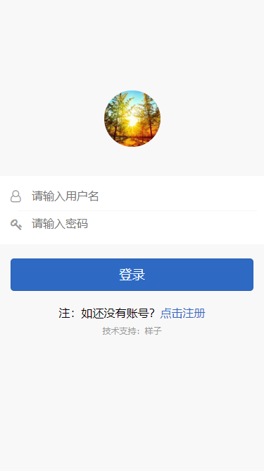

# 多房间聊天系统

一个 基于PHP + GatewayWorker + CI框架的 多房间聊天系统

## 更新

- 2020-08-15 简易版

## 使用

- 下载源码

- 修改config.php

- 添加我的微信（yangyang92428）捐赠20元获取源码

## 界面

具体设计可查看我的博客：[PHP + CI框架 + AdminLITE权限管理系统](https://www.cnblogs.com/yang-2018/p/11584974.html)
